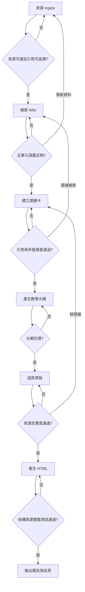

# IMU Wiki → HTML 簡報 Graph

```mermaid
flowchart TD
    A[來源 Ingest] --> B{來源可讀且引用可追溯?}
    B -- 否 --> A
    B -- 是 --> C[檢索 Wiki]
    C --> D{五單元涵蓋足夠?}
    D -- 否 --> C
    D -- 需新資料 --> A
    D -- 是 --> E[建立證據卡]
    E --> F{引用與矛盾檢查通過?}
    F -- 否 --> E
    F -- 需補檢索 --> C
    F -- 是 --> G[產生教學大綱]
    G --> H{大綱合理?}
    H -- 否 --> G
    H -- 是 --> I[逐頁草稿]
    I --> J{來源忠實度通過?}
    J -- 否 --> I
    J -- 缺證據 --> E
    J -- 是 --> K[產生 HTML]
    K --> L{結構與瀏覽器測試通過?}
    L -- 否 --> K
    L -- 是 --> M[輸出報告與反思]
```

規則：局部問題只退回最近相關節點；單一問題最多修正 3 輪。無法查證的事實不得進入下一節點。每輪結果填寫 `reports/check-log.md`。
